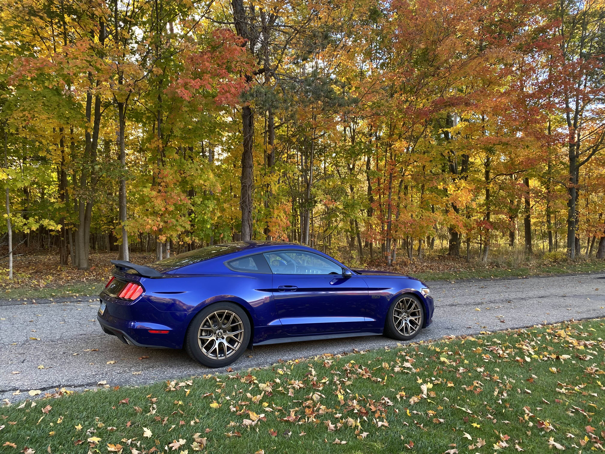
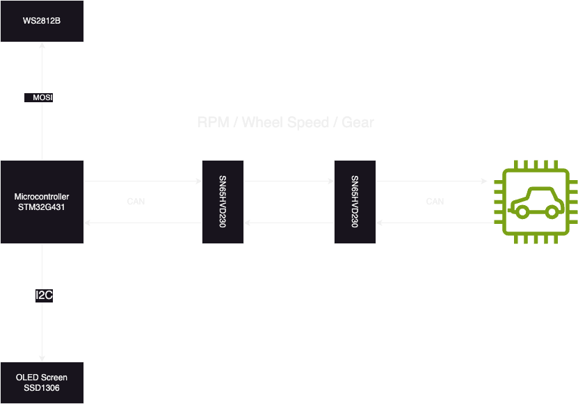

# CANSTANG

A DIY shift-light and HUD combo for my Mustang. 

## Components
A list of the main parts of the system
1. STM32G431RB
2. Waveshare SN65HVD230 Can-transciever
3. SSD1306 OLED Screen
4. WS2812b RGB LED(s)
5. Reflective HUD screen

# Architecture
