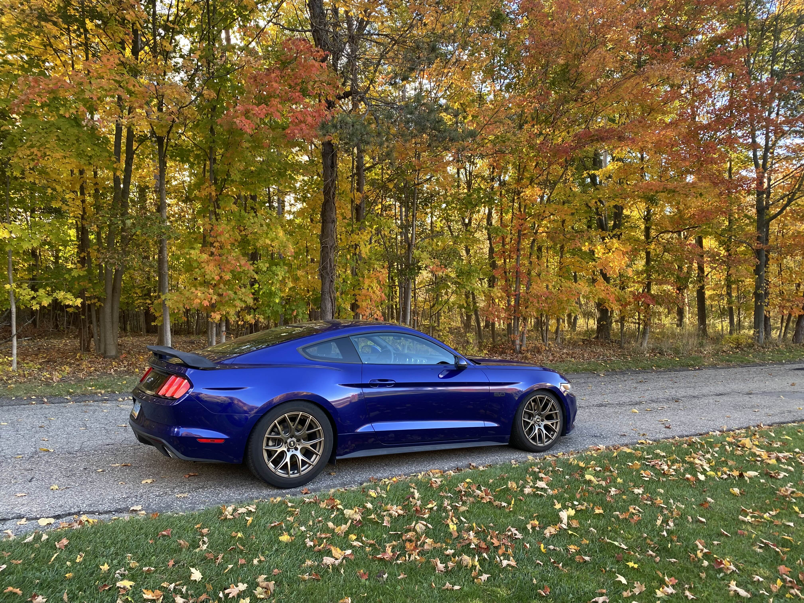

# CANStang

## Overview
A custom solution to intercepting the CAN bus on my 2015 Mustang GT. The two main features that I want out of this is 
- A shift light that can either go on the steering wheel / or 
at the back of my dash and act as a HUD. 
- A digital speedometer that will be on the HUD.
- (Optional) A gear indicator on the HUD as well.

## Hardware
### Microcontroller
Need to select a microcontroller capable of CAN, SPI, and I2C at the minimum. Everything else will be a plus. For the sake of cost, availibility, and popularity, an STM32 variant will do.
- STM32F103RB
- STM32L476RCT6
    - $5.50 per
    - 3x SPI, 1 CAN, 3x I2C
    - [Webpage](https://www.st.com/en/microcontrollers-microprocessors/stm32l476rc.html)
- STM32L432
    - $4.00+
    - 2x SPI, 2x I2C, 1x CAN
- STM32F446RE 
- STM32G431RB
    - $3.90
    - 3x I2C, 3x SPI, 1x CANFD
- Renesas RA4M1
- SAME51J20A
- LPC1800

There are probably a near infinite amount of options for a microcontroller, but I won't dig too deep. From the above, it'll be best to pick the one that 
1. Is cost-effective
2. Easier to implement i.e On-board memory
3. Has the best amount of resources for implementation. 
4. Comes in a development board.

#### Final decision
The STM32G431XX series chips is the one I'm going with. This is due to cost, since a lot of the other chips are >$5, and because it supports a clock speed up to 170Mhz, which makes things a little better for CAN sniffing.

[Nucleo Board](https://estore.st.com/en/nucleo-g431rb-cpn.html)

[Flashing tool for PCB](https://www.st.com/en/development-tools/stlink-v3minie.html)

##### Features
- 3x I2C
- 3x SPI
- CANFD
- 170MHz clock speed
- Has cheaper variants that are available (as of December 2024)
### LED Strip
It'll be wortwhile to just get a small LED strip, using WS2812b's or similar, that can be trimmed down if needed. These can then be put onto the final PCB as well. 

### HUD Components
 1. Reflective HUD screen for the Car windshield, can trim this down
 2. Decide between OLED or 7-Segment display for RPM / Speed

# Architecture

# Resources
[S550 Mustang GT CAN Id list](CAN_IDs.md)

